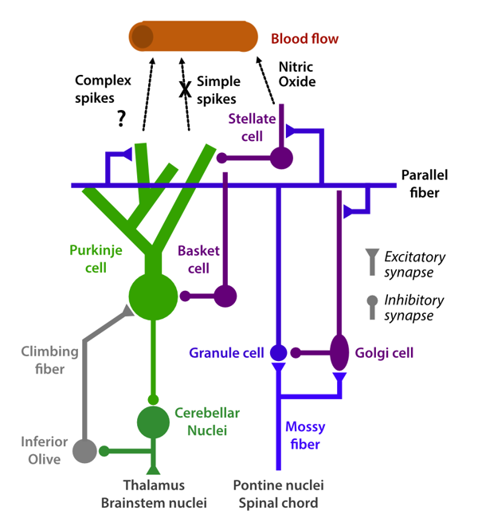

# Making Sense of the Cerebellar BOLD Signal

<section markdown="1">
We – like many others – are using functional magnetic resonance imaging (fMRI) to gain insight into cerebellar function.  For this endeavor, we must consider a foundational question: How do we interpret changes in the blood-oxygenation-level dependent (BOLD) signal from the cerebellum?  What are the physiological processes that underlie this signal?

Much of our work is based on the strong-sounding assumption that the cerebellar BOLD signal mostly reflects mossy-fiber input and granule-cell activity without a contribution from the spiking of Purkinje cells. That the BOLD signal is dominated by synaptic transmission, rather than firing rate of output cells, is also true for the neocortex.  However, we assume that this is even more decisively the case for the cerebellum. In papers and talks there is never enough space to spell this argument out fully.  We therefore wrote this blog to provide a more detailed account of our reading of the literature and general reasoning.{+side: This blog is adapted from our published response to the [review of Shahshahani et al. 2024.](https://elifesciences.org/articles/96386/peer-reviews#content)}

A positive BOLD signal is caused by an increase in blood flow which overcompensates for the local increase in oxygen demand. Most relevant to our questions are studies that directly investigate the mechanism of vasodilation in the cerebellar cortex. Indirectly, we can also make guesses about the mechanisms that will lead to blood flow increases by looking at the contributions of different neurophysiological mechanisms to cerebellar metabolism [+citep:Attwell2002].

**Cerebellar circuit and bloodflow regulation.** Mossy fibre to granule cell and granule cell to Purkinje cell signal transmission (blue and purple) are the main driver of vasodialation in the cerebellar cortex. Purkinje cell simple spike firing does not seem to modulate bloodflow. Complex spikes caused by climbing fiber input increases bloodflow, but the relative contribution of this pathway to cerebellar BOLD is likely much smaller than mossy-fiber input.

## Vasodilatory mechanisms

The mechanisms that cause vasodilation in the cerebellum have been extensively studied. Electrical stimulation of mossy fibers [+citep:Gagliano2022;Mapelli2017] and parallel fibers [+citep:Mathiesen1998;Akgoren1994;Yang1997;Iadecola1996] lead to a robust increase in cerebellar blood flow. In contrast to the neocortex, these changes are near exclusively dependent on the vasodilator Nitric Oxide (NO) [+citep:Akgoren1994;Yang1997], with stellate cells playing a key role in the signaling cascade [+citep:Yang2000]. Electrical [+citep:Mathiesen2000] and pharmacological [+citep:Yang1998] stimulation of climbing fibers also leads to a robust increase in blood flow. Simultaneous parallel and climbing fiber stimulation seems to combine sub-additively in terms of blood flow changes [+citep:Caesar2003].

A critical observation is that even large-scale changes in the spiking rate of Purkinje cells does not lead to changes in vasodilation. For example, parallel fiber stimulation leads to an increase in blood flow even though the net effect on Purkinje cell firing is inhibitory [+citep:Mathiesen1998]. More dramatically, complete inhibition of Purkinje cells using a GABA agonist does not change baseline cerebellar blood flow [+citep:Caesar2003pnas]. Conversely, a 200-300% increase in simple spike firing rate through the application of a GABA antagonist does not yield any measurable changes in blood flow even though it increases the metabolic rate of oxygen consumption in the tissue [+citep:Thomsen2009].

In sum, this extensive set of studies clearly argues that the cerebellar blood flow response is mostly dictated by mossy-fiber to granule cell transmission. Changes in the firing rate of Purkinje cells (even in response to manipulations that dramatically exceed the natural dynamic range) does not influence vasodilation – thus, changes in Purkinje cell firing do not lead to changes in the cerebellar BOLD signal.

What is less clear is the degree to which changes in the BOLD signal during normal activity reflect climbing fiber input. Similar to what is observed following disruption of the mossy fiber pathway, lesion of the climbing fiber pathways result in a 60-70% reduction in the evoked blood flow response during whisker stimulation [+citep:Yang2000;Zhang2003]. However, it is unclear how these manipulations relate to the relative contribution of climbing fiber input in the intact animal. For this we need to look at how these two pathways behave under normal circumstances.

## Cerebellar metabolism

To estimate the relative contribution of changes in climbing fiber / mossy fiber input to the cerebellar BOLD signal under natural conditions, it is useful to consider how different cerebellar processes contribute to the overall metabolic rate of the cerebellum. Assuming an average firing rate of mossy fiber of 40Hz, a firing rate of granule cells of ~3Hz, and a climbing fiber rate of 1Hz, [+citet:Howarth2010] estimated that the transmission from mossy fibers to granular cells consumes about 53% of the cerebellar energy budget. The next processing stage, the transfer of information from granular cells to Purkinje cells, accounts for 32% of energy expenditure. In contrast, integration within and spiking (simple and complex) of Purkinje cells represents only 15% of the total energy consumption [+citep:Howarth2012].

More important for the BOLD signal, however, are the activity-induced variations in metabolic consumption. Purkinje cells fire at a very high frequency (~50Hz), a rate that is maintained during both wake and sleep (Shin et al. 2007).  Given that Purkinje cells inhibit the cerebellar output nuclei, Purkinje cells need to decrease their activity to activate the cerebral cortex, which would decrease the metabolic demand of Purkinje cells. Climbing fibers at baseline fire at ~0.5 Hz, and even during conditions that produce an increase in activity, rarely fire much above 2Hz [+citep:Streng2017]. In contrast, granule cells show a low firing rate during rest (typically <1hz), but can rise to spiking rates above 100Hz during activity. When considering the sheer number of granule cells, these values would suggest that the vast majority of the variation in metabolic demand are due to mossy fiber input and granule cell activity.

## Summary and Conclusions

Given the above arguments, we think it likely that the main determinant of the cerebellar cortical BOLD signal is mossy fiber input and the transmission of information from mossy fibers to granule cells and onward to Purkinje cells. We recognize that the degree to which climbing fiber input contributes to the cerebellar BOLD signal is less clear. Importantly, the data indicate that the firing rate of Purkinje cells themselves makes a negligible contribution to the cerebellar BOLD signal as even dramatic changes in their firing rate does not cause any changes in vasodilation.

In essence we think that imaging the cerebellum is like looking into a clear mountain lake: You do not see what is going on under the surface (the activity of Purkinje cells), but rather you see the reflection of the surrounding mountains in the lake (i.e. how cortical activity arrives in the granule cell layer). We believe this has important consequences for interpreting the cerebellar BOLD signal. First, we can only make sense of what we see if we analyze it in the context of the neocortical activity -  that is, we need to take the surrounding mountains into account. Second, the correlation between cortical and cerebellar BOLD signals will tell us much more about the signals that the neocortex send to the cerebellum, rather than about the signals that the cerebellum sends to the neocortex [+citep:King2023]. This is simply because we cannot see firing changes of Purkinje cells. Nonetheless, we believe we can learn something about cerebellar processing from fMRI by considering the BOLD responses in the cerebellum relative to the BOLD responses in the neocortex. Specifically, we found that, relative to the strength of the corresponding neocortical activity, cerebellar activity was especially high when cerebellar processing was required [+citep:Shahshahani2024]. It appears therefore that sometimes the reflections on the lake are especially strong – which provides us with insights about the lake itself.

This is our current take on how one should treat fMRI data when drawing inferences concerning cerebellar function.  It would certainly be useful to re-examine many of the physiological findings cited with more modern techniques. And most important, we welcome discussion and comments to this blog:  If you are aware of other relevant results or if you have a different interpretation of this literature, we would love to hear from you!
</section>
