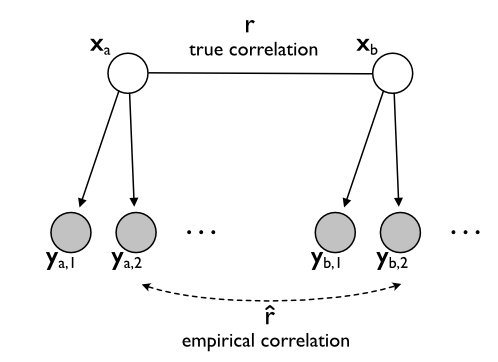

# How can we calculate the true correlation between two activity patterns? 

# What is the *true* correlation between two activity patterns? 
<section markdown="1">

In neuroimaging, we often want to know how similar, or overlapping, two brain activity patterns are. If two tasks (let's call them *A* and *B*) activate a specific brain region in a similar way, we can infer that this brain region does something similar in the two conditions. If the activations are very different, we can conclude that this brain region does something quite dissimilar in the two situations. Often, we are not so concerned with the question whether task *A* activates the brain region more than task *B* - rather we want to know whether the *pattern* of activation across the brain's surface is the same or not - that is, we are interested in the *correlation* between the two activity patterns. 
{+margin:m1:Of course, sometimes we do care about the amount of activation, in which case correlations are not the right measure. But that's a topic for another blog.}
The question of the correlation between two activations patterns re-occurs over and over. How much does encoding and retrival of the same item lead to similar activity pattterns? How about planning and execution of the same movement? Or does the pattern related to a specific movement change with training?

## So what's the problem? 
Statistically speaking, we are interested in the correlation between two vectors  $\mathbf{x}_A$ and $\mathbf{x}_B$.  Easy, you may say. Just correlate the two vectors! But here is the hitch: we don't actually have the true activity patterns. Rather, we measure each of the patterns with noise - and if we use functional magnetic resonance imaging (fMRI), we have lot of it! Graphically, we can represent the situation as such (Figure 1). We are interested in the correlation between two true (but unobservable) activation patterns  $\mathbf{x}_A$ and $\mathbf{x}_B$.  We have a range of observations of each activity pattern  $\mathbf{y}_{a,1}, \mathbf{y}_{a,2},...$ which differ from the true patterns by the measurement noise. 

**Figure 1.** Graphical model representation of measurement problem. Observed variables are represented in shaded circles, unobserved variables in empty circles. Correlations are represented with undirected edges. The measures are dependent on the true patterns (arrows), but are conditionally independent of each other. 

The obvious way to go about this, is to average the patterns across our measurements for the two tasks, resulting in $\bar{\mathbf{y}}_a$ and $\bar{\mathbf{y}}_b$, and then just correlate those me an patterns. The problem is that the empirical correlation underestimates the true correlation substantially. This phenomenon can be seen in simulation in Figure 2. The individual measured correlations (green dots) tend to be below the true correlation (dashed line).  As the signal / noise ratio decreases, this bias becomes more severe. In the extreme, when we have no signal, the correlation will go down to zero. 

**Figure 2.** Normal correlation estimates (dots) systematically underestimate the true correlation (dashed line) in a signal-dependent fashion. See this notebook to play around with this simulation. 

This is not a problem, if we just want to test the hypothesis that the true correlation is larger than zero ($r>0$). Just calculate the individual correlations per subject and test them against zero using a *t-*test. However, sometimes we want to test whether the true correlation has a specific value (for example $r=1$, indicting that the activity patterns are the same), or we want to test whether the correlations are higher in one brain region than another. Brain regions measured with fMRI can often differ dramatically in their signal-to-noise ratio. Thus, in these cases we need to take account the problem of measurement noise. 
</section>

<section markdown="1">

## Solution 1a: Compute noise ceilings

The first idea is to determine what the theoretical bias in the correlation is. If we just knew this number, we should be able correct for it, no? To figure this out we can ask ourselves what the correlation between two measured activity patterns would be, if the true activity patterns were perfectly correlated. This is often called the **noise ceiling** for the correlation. 

To derive this quantity, we need to do a little bit math. The measured patterns are 

$$
\begin{align}
\mathbf{y}_{a,i} = \mathbf{x}_{a} + \epsilon_{a,i}\\
\mathbf{y}_{b,i} = \mathbf{x}_{b} + \epsilon_{b,i}
\end{align}
$$

and the assume that these have a specific variance (across voxels and repetitions: 

$$
\begin{align}
var(\mathbf{x}_a)=var(\mathbf{x}_b)=\sigma^2_{s}\\
var(\epsilon_a^2) = \sigma^2_{\epsilon a}\\
var(\epsilon_b^2) = \sigma^2_{\epsilon b}
\end{align}
$$

Then the correlation between a measure of $A$ and $B$ would be 

$$
\begin{align}
r_{ceil}=\frac{cov(\mathbf{x}_a,\mathbf{x}_b)}{\sqrt{var(\mathbf{x}_a),var(\mathbf{x}_a)}}=\frac{\sigma^2_s}{\sqrt{(\sigma^2_s+\sigma^2_{\epsilon a})(\sigma^2_s+\sigma^2_{\epsilon b})}}
\end{align}
$$

Now - how can we estimate the variance of the true pattern (signal) and the error (or noise)? If we have multiple measures of our pattern, we can estimate the split-half reliability, the correlation between two independent halves of the data. If we assume that the noise has the same variance across these two halves then limiting value is: 

$$
r_{rel,a}=r(\mathbf{y}_{i,1},\mathbf{y}_{i,2})=\frac{cov(\mathbf{y}_{a,1},\mathbf{y}_{a,2})}{\sqrt{var(\mathbf{y}_{a,1}),var(\mathbf{y}_{a,2})}}=\frac{\sigma_s}{\sigma^2_s+\sigma^2_{\epsilon a}}
$$

and by substitution in the previous formula, we can see that the noise ceiling for a correlation between two measured vectors (ie. the value that we should get if the true vectors are perfectly correlated) is the *geometric mean*, i.e. the square-root of the product, of the two reliabilities.
{+margin:m1: This is the noise ceiling for the correlation between each of the two independent halves of the data. If we are interested in the noise ceiling for the correlation between the mean measured patterns, we need to account for the fact that we averaged of 2 (or in general N) independent measure. See the accompanying jupyter notebook for details. }

$$
r_{ceil}=\sqrt{r_{rel,a} r_{rel,b}}
$$

So now we should just be able to normalize our measured correlation by deviding it by the noise ceiling for correlation! As can be seen in Figure 3 (solid blue line) this works really nice if the signal to noise ratio is quite high. In this case the corrected estimate approaches the true correlation. For low signal-to-noise levels (and with fMRI we are usually in this domain) the correction stops working correctly. What is going on? 

**Figure 3**. Mean correlation estimates for simulated data. Uncorrected (green line), corrected by noise ceiling (blue line), or correction by using cross-block covariances (red-line). 

One problem is that  for low signal-to-noise in some cases $r_{rel,a}$ or $r_{rel,b}$ (or both) become negative, so that a real square root does not exist anymore.  Here we have two options: First, we can either exclude these values from further analysis (solid line), or we can replaced them with a specific value, for example $0$ (dashed line). Latter process is called *imputation*. Unfortunately, neither exclusion nor imputation of these values fixes the problem. Both procedures show a positive bias, switching into a negative bias for low signal to noise values. In general the problem is that the estimates become quite unstable when one of the reliabilities gets very small. 

## Solution 1b: Use cross-partition covariances
A very related solution is to use so called "cross-validated" estimates of the correlation. Here we directly compute the correlation, but we replace the estimates for variances in the denominator with the average covariance between different partitions of the data that are independent. 

$$
\begin{align}
\hat{cov}(\mathbf{x}_a,\mathbf{x}_b) = \frac{1}{N(N-1)}\sum_{i \neq j}cov(\mathbf{y}_{a,i},\mathbf{y}_{b,j})\\
\hat{var}(\mathbf{x}_a) = \frac{1}{N(N-1)}\sum_{i \neq j}cov(\mathbf{y}_{a,i},\mathbf{y}_{a,j})
\end{align}
$$

This we can then plug into our variance estimator

$$
r_{cb}=\frac{\hat{cov}(\mathbf{x}_a,\mathbf{x}_b)}{\sqrt{\hat{var}(\mathbf{x}_a)\hat{var}(\mathbf{x}_a)}}
$$

This estimator (Figure 3, red line) behaves very similar to the noise-ceiling correct estimator. Indeed, if you dig a bit through the math, you will realize that the differ only in the sense that one uses the ratio of  correlations, the other of covariances. Again we have the problem of unstable estimates and missing values (due to negative variance estimators) for low signal-to-noise levels. 

</section>

<section markdown="1">

  ## Solution 2: Using Pattern Component Modelling 

Ok, so what can we do instead? Obtaining unbiased estimates of the true correlation is very tricky, as we have seen above. So can't we turn the problem around? Rather than asking which correlation is our best estimate given the data, let's instead ask how likely the data is given different levels of correlation. This can be done using *Pattern Component Modelling*, an approach were we simply use the generative  model shown in Figure 1, and calculate $p(Y|r,\theta)$, the probability of the data given a specific correlation r. To calculate this probability we also need to estimate some other parameters, the variance of the signal ($\mathbf{x}_a$,$\mathbf{x}_b$),  and the noise ($\epsilon$). A practical way of estimating the parameters is simply to maximize them, i.e. use
$$
p(Y|r) \approx max_{\theta}{p(Y|r,\theta)}
$$
Some call this cheating, other people call it empirical Bayes. In this case, however, this technique works quite well, as all correlation models have the same number of parameters and we are mainly interested in comparing the probabilities across models, all of which will have a similar bias. 

Figure 4 shows an example of this entire approach in action. Using the PCM toolbox, this analysis take only a few lines of code (see the accompanying jupyter notebook and the PCM online documentation for details).   

## Extensions
The main strength of using a generative model (and a practical Bayesian approach) to tackle the question of estimating the true correlation in more complex situations.  

</section>
