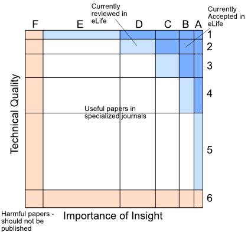

# Rethinking peer review at eLife
## Replacing the journal name as a quality indicator

<section markdown="1">
*This blog reflects preliminary and ongoing dicussions in one eLife editorial working group with Michaela Iordanova, Tim Behrens, and Andy Collings. The ideas and opinions expressed here do not reflect a consensus from across the eLife editorial board. With permission of the working group, I am putting these ideas out here for discussion and feedback.*
</section>
<section markdown="1">

## On the current state of peer review
The current scientific peer-review system has recieved much, and often well-justified, critism for being secretive, biased, and inefficient [+citep: Fisher2015][+citep: smith2006peer][+citep: godlee2002making]. Now that posting manuscripts before submission on preprint servers has become the norm, and more and more reviews are openly posted, it is time to think openly accessible quality indicators. Before introducing more changes to the peer review system, however, it is important to acknowledge the two important functions that a primary, obligatory, and structured peer review still fullfils. 

First, peer review, and the subsequent revision, does tend to make scientific papers better. In the ideal scenario, the paper improves through a constructive dialogue between editors, authors, and reviewers - and the post-review discussion between editors and reviewers in eLife certainly makes this outcome more likely. I know - it doesn't always work, but often as authors we have blind spots, and reviewer comments can help us to address possible gaps, mistakes, and omissions before the paper becomes final. Even a reviewer who dramatically misunderstands my paper still provides me the chance to figure out how to make the paper clearer. After all, future readers won't be systematically different from reviewers. 

The second function of peer review is to provide an initial quality evaluation of papers.  We are all looking for fast and easy indicators of which papers are worth the time. Currently, one of the most important indicator is the journal name. It serves - for the better or the worse - as a proxy for the quality of a paper, a whole lab, or the quality of a job candidate.  We have come to expect that a *Nature Neuroscience* paper should be better than a *PLoS One* paper. However, which journal a paper is published in, is often a product of a series of stochastic events, each of which is highly susceptible to social influences and subjectivity.  

Problems with peer review arises often from the fact that these two functions, improving and evaluating, are incompatible with each other. Reviewers often wish to signal that the paper is "not good enough" for the specific journal, and this will overshadow their whole review, making their comments less than helpful for improving the paper. Some reject decisions signal that the paper has a deep flaw that prevents it from becoming part of the scientific literature, other reject decisions mean that the paper wasn't judged to be of broad enough interest. To game the system, authors overstate the importance of their work, consciously not citing previous literature to stress its novelty and uniqueness. This obfuscates the literature, and the repeated review in a series of journals makes the system slow and inefficient. 

One of the long-term goals of *eLife* is therefore to *move science away from the use of journal titles as the primary measure of the quality of research* [+citep:eisen2020]. Of course, it would be ideal if we would all actually *read* the papers that we judge.{+side:Crazy idea, I know.} However, expecting a job search committee to read most of the papers from most of the candidates is unfortunately not realistic. In my experience, a panel is doing quite well if some committee member have read at least one paper from each long-listed candidate. Thus, if we like it or not, as an individual, we often have to rely on quick heuristics to determine the quality of papers{+side: A clear case of *bounded rationality* in the sense that cognitive capacity and time constrain our decisions [+citep:simon1972].}. If we take away the journal name as one of the main indicators of quality without providing an alternative, the community will start using something else, such as the name of the institution, number of social media engagements, or other metrics that may be even more fraught with social bias than the current peer review system. 

## The proposed rating system  
Here is *one* proposal that is being currently discussed in the eLife working group. It is a simple rating scheme that could be applied to all published empirical papers on pre-publication servers. The proposed rating has two dimensions: the *importance of the scientific claim* and the *quality of the data and methods*.{+side: Other dimensions and additional badges (for data sharing, etc) are of course possible. However, the proposed two dimensions may provide a good compromise between providing enough detail without getting too complex.} The two dimensions should be judged separately, as papers clearly differ to what degree they succeed in either category. The increased  sophistication of data collection techniques has led to some labs specializing in creating high-quality data sets, while other groups may focus on novel theoretical models and ideas. The rating system acknowledges that both types of papers are important for driving science forward. 

{+margin: **Table1**: Proposed rating categories for the two axes of evaluation. As an anchor, the desired % of papers of the peer-reviewed record is given in the last column}

| |**Importance of claim / insight**| |**Technical Quality**|% of papers|
|-|----------------------------------------|-|----------------------------------------|---|
|**A**| The insights (if true) will substantially change the way we think about an entire field - or have life-changing practical implications. Important idea that everybody in the field should know about. |**1**| The data and analysis exceed by far the current state of the art in the field. A major methodological step forward that will shape research methodology in the field for years to come. |2%|
|**B**|The insights are novel and change an important aspect of a current theory or research question. |**2**| Data and analysis are of very high quality, in multiple aspects more rigorous or inventive than the current state of the art. |8%| 
|**C**|The insights provide an important piece of knowledge that speaks to an well-defined research question. Is likely of interest to readers outside the specific subfield.|**3**|Data and Analysis are performed according to state of the art, solidly supporting the conclusions. No real weaknesses. |15%|
|**D**|The insights have theoretical or practical implications for a specific field, but are mainly interesting to readers in that subfield. |**4**| Data and Analysis are generally conclusive, only with minor weaknesses. |40%|
|**E**|Useful, but with limited importance or scope. Replication of well-known phenomena or relatively incremental advance.|**5**|Data and Analysis are of sufficient quality to provide some support for claims. Due to some weaknesses in experimental design, data set, and/or analysis, there are some limitations in the interpretation. |35%|
|**F**|Ill-posed scientific question or ignores important previous results. Should not be published in any journal until revised. |**6**|Insufficient quality of data or analysis to support the claim. Should not be published in any journal until revised. |-|

{+margin: Papers of insufficient technical quality, or with ill-posed research questions, will receive a F or 6 mark, respectively. The function of any peer review is to not let these papers become part of the scientific record without major revisions. Revisions would either need to improve data or methods or tone down the claims of the paper. Thus, these categories would not be chosen for papers that are accepted by any journal.} With these two rating scales, very few papers (<1%) will receive an A1 rating. A highly elegant technical contribution that is mostly interesting to a restricted field may receive an D1 rating. In contrast, a paper with a very interesting idea (aka the “sexy” story), but only preliminary support for the claims, could be labelled as A5. The rating of the paper should be accompanied by a written evaluation summary and the public review that justify the rationale behind the final rating. 

**Figure 1.** Two-dimensional rating of all papers. A rough estimation of the papers that are currently being reviewed in eLife (light blue), and that are being judged as having sufficient quality after revision (darker blue). It is likely that some papers currently published eLife papers would be rated with C3. 

### Proposed process 
{{Review process:}} It is important that the rating of papers does not interfere with a constructive peer-review process that is aimed at improving the paper. One possibility is therefore that the written evaluation summaries and ratings are only attached to the final accepted version. {+margin: Alternatively, a evaluation rating could be attached to together with the public review to earlier version of the paper, as long as they are clearly visible as just referring to the current version on the pre-publication server. Currently, TRiP reviews on BioRxiv are not clearly labeled to refer to a specific version of the paper.} We think the rating scheme, however, can be a useful *communication tool* in the review process. For example, an editorial assessment could read: “In the current version, I believe that some of the most interesting and highly controversial claims are not fully supported by the evidence (A6). If the authors concentrate on the interesting topic of X, we believe that the paper has the potential to become an important and solid contribution to the literature (B3)." 

{{At final decision:}} When the reviewers, editors and authors ultimately decide that the paper has its final form, the handling editor will draft the evaluation summary + the rating. We believe that the rating will improve the quality and impact of the evaluation summary - the written summary will need to spell out a justification for the quality ratings, rather than just summarizing the main findings. We believe that a rating scheme will help the evaluation summaries to become more concrete and incisive. The editor will send both rating and evaluation summary to the reviewers for discussion and approval. Finally, both are being reviewed and approved by the senior editor. If there is disagreement among reviewers and handling editors, the senior editor should go back and consult with the BREs that were involved in the initial screening of the paper, until a final rating is achieved.{+side: Reviewers also have the option to note their dissent from final decision using post-publication review and evaluation tools (see below).} In case of exceptionally highly rated papers, the senior editor may want to consult even with a broader range of senior and board editors to ensure that the paper really is of such a broad interest as the rating indicates. 

### Introducing the system 
The first step would be to apply the rating scheme to all published papers in eLife. The rating together with a 2-3 sentence evaluation summary should be clearly visible on PubMed and other search engines. One immediate positive consequence would be that eLife could be less selective when pre-screening and accepting papers, without diluting the journal brand. That is, a A1 paper in eLife will still have the same value, no matter how many D4 papers maybe published alongside it in the same issue. Editorial screening before review could be less selective and would mainly be constrained by the number of available handling editors and reviewers. 

The next step is to persuade other journals to join a consortium that applies the judgement scale consistently. For this to work, it is extremely important to make the criteria as clear and transparent as possible, consistently anchoring them on a curve by defining the percentiles of papers in each category (see Table 1). 

## What could possibly go wrong? 
### Authors will want to appeal the final rating
We anticipate that (as currently with paper rejections) many authors will want to appeal the final rating. To manage this process, we think that it is useful to outline the potential ratings in the decision letter after the first round of review. Thus a decision letter could read: *If you can clarify the remaining issues, the reviewers think that the final evaluation will be a B3. For a higher rating of technical quality, we think that new data collection addressing problem X would be necessary.* This hands some control over the fate of the paper back to the authors: They can address the problem with new data collection and analysis if they agree that this is worth it. Alternatively, they can opt to revise and publish the paper without new data collection with a lower rating. Or they can take the paper elsewhere for a different evaluation. Either way, transparency at early stages in the review will likely cap off many appeals. 

### It places too much power in the hand of editors and reviewers
Many of us may feel uncomfortable with being judged in such a public and quantifiable way. After all, editors and reviewers are just a very small sample of future potential readers. Is it not handing a small handful of people the ability to make or break scientific careers?

These concerns are real and valid. The fact, however, is that this power is already lying with editors and reviewers who ultimately shape accept/reject decisions. The power for the highest ratings lies with professional editors of journals like *Nature* and *Science*, and the reviewers that they select, with motivations and criteria not entirely transparent. So how can the new rating system be less arbitrary and biased? I believe there are at least 3 ideas that may help addressing some of these concerns. 

First, at the final decision, the authors are given the option of withdrawing the paper in its current form and not publish with the proposed rating. The open assessment would still be posted on the preprint server, but clearly labeled to refer to the submitted version. The authors then have the option to revise the paper and seek new review and a different rating by a different journal. 

Second, the primary peer reviews and initial rating should be only the starting point for a continued evaluation of the paper in the scientific record [+citep:kriegeskorte2012open]. For this to be effective, we require a consistent and unified platform for secondary post-publication review, which allows individuals or other review consortia (such as F1000) to propose and justify competing ratings of a paper. This would take the edge off the stochasticity of the initial rating.{+side: Having a plurality of opinions out there in a common framework also allows the introduction of numerous other peer evaluation functions, which could providing numerous lenses that can be use to evaluate the scientific literature. For a range of highly relevant ideas, see [+citet:kriegeskorte2012open]}. 

Third, it is important to have a mechanism that allows editorial boards to revise the initial rating of a paper.{+side: Often the real impact of a paper is only becoming clear a few years after publication: A new methodology or theory may been become widely adopted, methodological faults may be subsequently revealed, or replications of a new phenomenon may systematically fail.} Algorithms can automatically highlight papers for which the subsequent citation counts or secondary review ratings are outside some confidence bounds for the initial rating. Such papers would be explicitly re-rated. This will hopefully encourage authors to focus on producing lasting contributions to the literature, rather than aiming for a quick, but only transient impact.  

### Authors will go shopping for better ratings
The flip-side of allowing authors to submit already evaluated paper elsewhere is that it may replicate the problems that make the current system inefficient. However,  forsaking a rapid publication of a paper for a future, but highly uncertain, better rating, should hopefully not be too attractive to authors. Also, having older reviews of previous versions of papers available as part of the public record would help mitigate the problem. As the current practice of forwarding reviews to a new journal, it would allow authors to fully respond to the concerns raised in the first round, preventing unnecessary and frustrating repetitions of arguments.  

A related problem is that specific journals (or review consortia) may start to inflate ratings to attract both authors and readers. How to ensure consistency of the rating across journals or review consortia is of course a difficult issue. It is not clear that an oversight board that enforces the standards and (in the worst case) withdraws the permission to use the rating system, is a feasible solution. A better approach is to make the system self-correcting without the need for a central authority [+citep:kriegeskorte2012open]. For example, the function that relates the primary ratings from each journal to the secondary ratings of the same paper would be an important indicator of inflated ratings. There needs to be an explicit motivation for each journal/consortium to keep this functions within some bounds of the identity line. For example, in case of systematic violations, a correction factor could be applied to all ratings from that journal when integrating ratings. 
</section>

<section markdown="1">
## Conclusions
All in all, peer review is in many ways like democracy: It is flawed in many ways, but compared to other exisiting systems, it is still the least unfair and malevolent. In a time of faster publication, and increased public scrutiny and distrust of science, however, it is high time to not only have open access to scientific publications, but also open access to scientific evaluations. The editorial changes in *eLife* may sometimes seem disruptive, but we need to keepmodernizing peer review, such that it can keep fullfilling its important functions in the future. 
</section>
