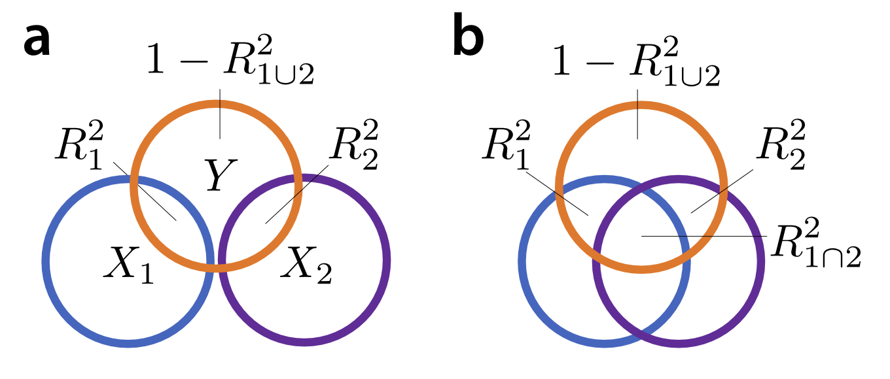
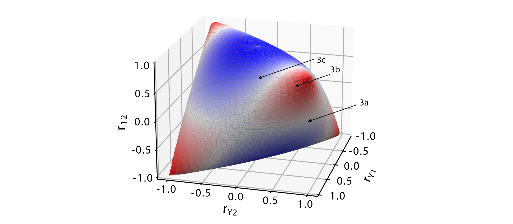
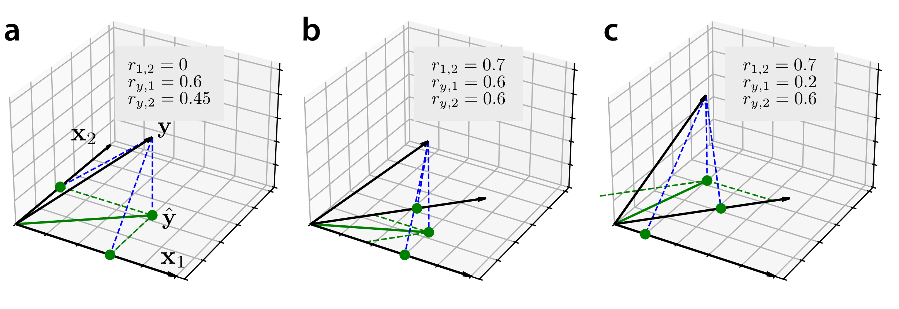
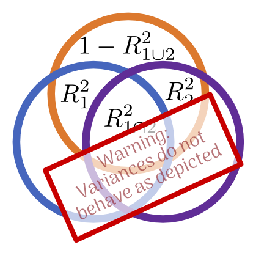

# Variance partitioning: a seductively simple, but misleading idea

<section markdown="1">
In the context of statistical modelling, one often comes across the idea of variance partitioning, which quantifies how much of the variance of a dependent variable can be explained by a certain experimental feature. In this blog, we highlight why this simple idea can lead to misleading intuitions and apparent paradoxes.

The idea of variance partitioning in linear models goes back to Fisher's ANOVA [+citep:fisher_statistical_1925]. The proportion of variance explained by a certain set of predictors is the $R^2$ value for that model. In the case of a balanced ANOVA, where $X_1$ and $X_2$ are orthogonal, the variance of the dependent variable $Y$ can be decomposed the into a part explained by predictor $X_1$, a part that us explained by predictor $X_2$, and a portion that is unexplained by either (Fig. 1a). The amount of variance that can be explained when we combine the two regressors into a joint model ($R_{1 \cup 2}^2$) is the sum of the amount of variance explained by each one alone ($R^2_1 + R^2_2$). Thus, in this we can think about the variance of $Y$ as a pie that can be sliced into different parts.

The trouble starts when we try to generalized this intuition to the more general case in which $X_1$ and $X_2$ are correlated. In these cases, most often the variance explained by two predictors together is smaller than the sum of the variance explained by each regressor alone. This is because, so the logic goes, there is a "shared" proportion of the variance that can be explained by either regressor. Thus the joint explained variance is the sum of the individual explained variances minus the overlap ($R_{1 \cup 2}^2 = R_{1}^2  + R_{2}^2 - R^2_{1 \cap 2}$), a relationship that is often depicted as an overlapping Venn diagram (Fig 1b). Following this logic, the variance explained by one regressor alone ($R^2_1$) consist of the 'shared' variance ($R^2_{1 \cap 2}$) and the part that is 'uniquely' explained by the regressor ($R^2_{1 \setminus 2}$). This approach can be extended for more than 2 groups of regressors [+citep:heer_hierarchical_2017].

**Figure 1.** Depicting explained variances as a Venn diagram. (a) For independent regressors, the variance explained by each regressor adds to the variance explained by both regressors together ($R_{1 \cup 2}^2 = R^2_{1}  + R^2_{2}$). (b) For correlated regressors the variance explained by both regressors is though of as the sum of the individual variances minus a portion that can be explained by both regressors, the shared portion of the variance ($R^2_{1 \cap 2}$).

So far, so intuitive. However, thinking about the variance explained by different models as a Venn-diagram can give you a number of wrong intuitions - and cause apparent paradoxes that will seem very confusing. In this blog we want to illustrate some of these cases and provide some more helpful graphical intuitions.

The first incorrect intuition you may take away from Figure 1b is that the variance explained by two regressor together ($R^2_{1 \cup 2}$) can never be bigger that the sum of the variances explained by each regressor alone. After all, that would make the shared variance ($R^2_{1 \cap 2}$) negative, right? Unfortunately, it is quite easy to generate a situation in which $R_{1 \cup 2}^2$ is larger than the sum of $R_{1}^2$ and $R_{2}^2$. This phenomenon is known is the statistical literature as suppression.

To understand when and how suppression occurs, let us consider the space of all possible correlations between two regressors ($r_{1,2}$), and between the dependent variance and each regressors  ($r_{y,1}, r_{y,2}$). Knowing these three correlations is enough to analytically derive the different explained variances for the simple 2-regressor case{+side:see [this jupyter notebook](https://github.com/DiedrichsenLab/VariancePartitioning/blob/main/variance_partitioning_analytical.ipynb) for the mathematical details.}. Not all combinations of these three correlations are possible - for example, if the two regressors are highly positively correlated, then their correlation with the dependent variable must be either both positive or both negative. The space of of possible 3x3 correlation forms the geometric shape depicted in Figure 2.

**Figure 2.** Space of possible combinations of correlations of the two regressors ($r_{1,2}$) and the correlation of the dependent variable with either of the two regressors ($r_{y,1}, r_{y,2}$). For the blue areas, $R_{1 \cup 2}^2$ is smaller than $R_{1}^2 + R_{2}^2 $, in the red areas $R_{1 \cup 2}^2$ is larger than $R_{1}^2 + R_{2}^2$. The arrows refer to the approximate locations depicted in Figure 3.

Along the 'equator' of this shape, where the two regressors are uncorrelated, the explained variance of the joint model is the sum of the individual explained variance, indicated by the white color.  A very useful graphical intuition is to think about the two regressors and the data as vectors in a $N$-dimensional space, with $N$ being the number of observations in our data vector (Figure 3). Simple regression can then be thought of as the projection of the data ($\mathbf{y}$) onto the vector ($\mathbf{x}_1$), or the vector ($\mathbf{x}_2$). For the joint model (multiple regression) the projection is onto the plane spanned by both vectors. The length of the vector of the predicted data ($\hat{\mathbf{y}}$) can be understood of the size of the predicted value - and the squared length of the vector is the explained variance of the model.

**Figure 3.** Linear regression viewed as geometric projection of the data vector ($\mathbf{y}$) onto the regression vector $\mathbf{x}_1$, $\mathbf{x}_2$, or the plane spanned by both. The predicted value ($\hat{\mathbf{y}}$) for each of the model is shown as a green dot. The amount of explained variance for each model is the squared distance of this dot from the origin. The green dashed line show the contribution of each regressor to the joint model (the semipartial correlation). The residuals for each model are indicated by blue dashed lines.

In the case of orthogonal regressors (Fig. 3a), we can immediately see{+side:from the Pythagorean theorem $c^2 = a^2 + b^2$} that $R^2_{1 \cup 2} = R_{1}^2 + R_{2}^2$. For correlated regressors, the situation is a bit more complicated. When the predicted value $\hat{\mathbf{y}}$ falls right between the two regressors (Fig 3b), the contribution of each regressor to the joint model (semipartial correlations, green dashed lines) are substantially smaller than contribution of the regressor alone.

However, the opposite can also be the case. Figure 3c shows a situation in which $X_1$ by itself explains very little of the data. When entered in into a joint model with $X_2$, it makes the contributions of both regressors bigger than their contributions alone. This lead to a situation in which $R^2_{1 \cup 2} > R^2_1 + R^2_2$. The phenomenon is called suppression: Even if $X_1$ does not explain any of the data itself, it can help in the overall model by suppressing or removing parts of $X_2$ that do not help in the prediction of $Y$, thereby increasing the overall explained variance. As can be seen from Figure 2, this effect dominates for half of the possible values of correlations. Suppression does not only occur in bi-variate simple regression, but generalizes to larger models with multiple groups of regressors, and to the setting of regularized regression.

Ok, you may say, but as long as we are in a situation as depicted in Figure 3b, where $R_{1 \cup 2}^2 < R^2_1 + R^2_2$, variance partitioning should work fine? After all, suppression is not observed very often in practice.{+side:This is likely because most often both regressors are positively correlated with each other and the data, that is we are only looking at one quadrant in Figure 2} Unfortunately, however, suppression effects occur all the time. The difference between the $R^2$ of the joint model and the sum of $R^2$ of the single model is always determined by the balance between the shared variance and suppression, even if suppression effects do not dominate.

This can lead to another incorrect intuition: when we observe that the $R^2$ of the joint model is the sum of $R^2$s of the single model, using variance partitioning, we would conclude that the shared variance is zero and the two regressor are explaining independent aspects of the data. However, as we can see in Figure 2, there are areas with high correlations between regressors where $R_{1 \cup 2}^2 = R^2_1 + R^2_2$. These situations arise in cases in which the shared variance and suppression effects cancel each other out. In these case, the predicted values of the single model are also correlated - so the two regressors DO explain overlapping aspects of the data.

In summary:

* the explained variances for nested models do not behave like a Venn-diagram
* the interactions between regressors is simultaneously shaped by the amount of shared variances (which lowers the joint $R^2$), and suppression effects (which increases the joint $R^2$)
* estimates of shared variance can therefore become negative
* an estimated shared variance of zero does NOT mean that two regressors explain non-overlapping aspects of the data
* in general, variance partitioning underestimates unique variances, as it ignores suppression effects

Thus, the contribution of a specific regressor must always be seen in the context of the other regressors in the model. The simple notion of partitioning of variance partitioning
Therefore, in our mind, depicting the variances explained by different models as a Venn-diagram should always come with a big warning label.

</section>
